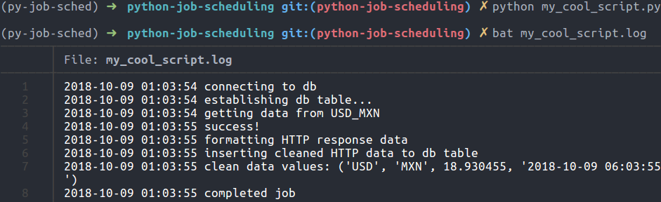
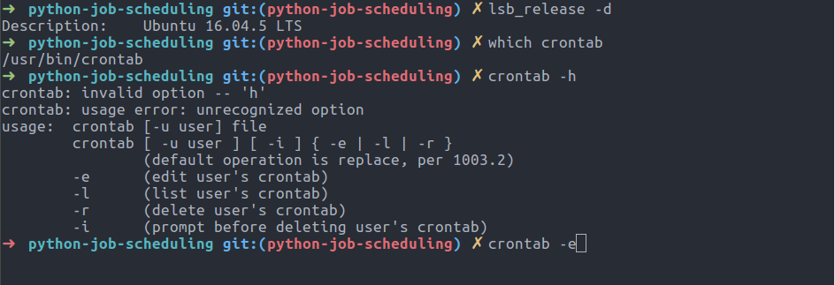
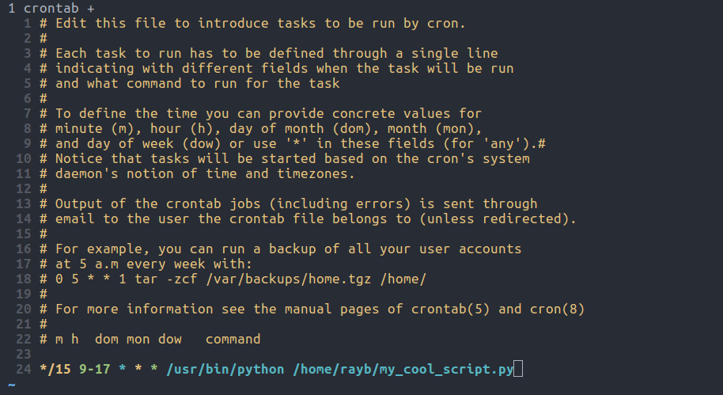
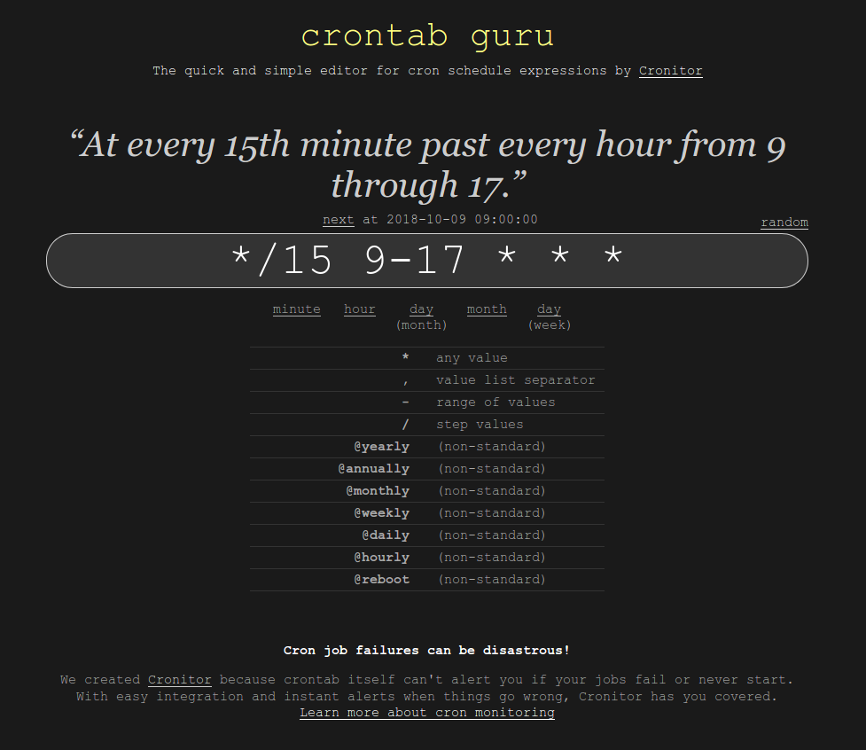

## Intro

<section style="text-align: left;">

- Learing Python is fun
- Python is practical
- learning is sometimes hard

</section>

## Scenario

<section style="text-align: left;">

Just finished writing a python script \n
that automates a tedious task and will: 

- save time 
- collect new information
- share insights
- something _useful_

</section>

## Python is great for automation!


## New Problem


## What will this talk cover?

<section style="text-align: left;">

- `cron` (and briefly Windows Task Scheduler)
- `schedule`
- `celery`
- `airflow`
- `AWS Lambda` 
- `GCP Cloud Functions`
- overview of trade-offs and how to decide which you should use

</section>

## About Me


Data Science @ [Pangea Money Transfer](https://pangeamoneytransfer.com/)

Undergrad: Occidental College

Masters: UC Berkeley

Started learning python January 2013

## Example Code for this talk

```python
from collections import OrderedDict
import logging
import requests
import sqlite3
import time


def get_currency_data(source_currency: str, dest_currency: str):
    base_url = 'https://free.currencyconverterapi.com/api/v6/convert'
    exchange = f'{source_currency}_{dest_currency}'
    logging.info(f'getting data from {exchange}')
    resp = requests.get(base_url, params={'q': exchange})
    if not resp.ok:
        logging.info(f'request failed with error: {resp.reason}')
        return
    logging.info('success!')
    return resp.json()
```

##

```python
def cleanup_data(currency_resp_data):
    logging.info('formatting HTTP response data')
    resp_values = list(currency_resp_data.get('results').values())[0]
    cleaned_data = OrderedDict()
    cleaned_data['source_currency'] = resp_values.get('fr')
    cleaned_data['dest_currency'] = resp_values.get('to')
    cleaned_data['exchange_rate'] = resp_values.get('val')
    cleaned_data['time'] = time.strftime(
      '%Y-%m-%d %H:%M:%S', time.gmtime())
    return cleaned_data
```

##

```python
def create_db_table(db_cursor):
    logging.info('establishing db table...')
    query = '''CREATE TABLE IF NOT EXISTS exchange_rates (
        source_currency TEXT, dest_currency TEXT,
        exchange_rate REAL, time TEXT)'''
    db_cursor.execute(query)


def save_to_db(db_cursor, clean_data):
    logging.info('inserting cleaned HTTP data to db table')
    clean_data_values = tuple(clean_data.values())
    logging.info(f'clean data values: {clean_data_values}')
    db_cursor.execute(
        'INSERT INTO exchange_rates VALUES (?, ?, ?, ?)', 
        clean_data_values)
```

## 

```python
def run_job():
    logging.basicConfig(filename='my_cool_script.log',
                        level=logging.INFO,
                        format='%(asctime)s %(message)s',
                        datefmt='%Y-%m-%d %H:%M:%S')
    logging.info('connecting to db')
    con = sqlite3.connect('exchange_rates.db')
    cur = con.cursor()
    create_db_table(cur)
    raw_data = get_currency_data('USD', 'MXN')
    clean_data = cleanup_data(raw_data)
    save_to_db(cur, clean_data)
    con.commit()
    con.close()
    logging.info('completed job')
```

## Example code log output



## `cron`

## 

<section style="text-align: left;">

`cron` is a job scheduler built into \*nix systems 

(e.g. Unix, Linux, BSD)

`crontab` (cron+table) is a config file for `cron`

Note: MacOS also uses `launchd` and in general views crontab as deprecated even though still supported

</section>

## 



##



##

[crontab.guru](https://crontab.guru/)



## `cron` is not python

<section style="text-align: left;">

**Pros**

- faily simple
- available by default on *nix systems

**Cons**

- scheduling syntax designed for computes, not humans
- requires that you are using *nix system
- hard to get user env and variables right
- crontab itself can't alert you if your jobs fail or never start (from https://crontab.guru)

</section>

## Windows Task Scheduler


[Link to Microsoft Docs for more information](https://docs.microsoft.com/en-us/windows/desktop/taskschd/task-scheduler-start-page)

## [`schedule`](https://schedule.readthedocs.io/en/stable/)

##

<section style="text-align: left;">

`schedule` is a _cron inspired_ module for Python

Primary design concern was making the syntax more _"human-friendly"_

</section>

## sample code

```python
import schedule
import time
from my_cool_script import run_job

schedule.every().hour.do(run_job)
# Every 1 hour do main() (last run: [never], next run: 2018-10-09 02:25:06)

while True:
    schedule.run_pending()
    time.sleep(3600)
```

##

<section style="text-align: left;">

**Pros**

- `schedule` is Python
- schedule syntax is way easier to read/write/interpret
- really easy to tack onto existing scripts
- more consistent and straight-forward that just the `time` module

**Cons**

- still can't alert you if your jobs fail or never start
- logging is up to you
- probably best to wrap in another tool like `nohup`

</section>

## [`celery`](http://docs.celeryproject.org/en/latest/userguide/periodic-tasks.html)

##

`celery` is a task queue

```
+---------+          +--------+            +----------+
|         |   Send   |        |   Worker   |          |
|         |   work   |        |   fetches  |          |
|  Job    | -------> | Queue  | <--------- |  Worker  | ---> [log]
|         |          |        |            |          |
+---------+          +--------+            +----------+
```

##

<section style="text-align: left;">

`celery` requires something else to serve as the broker, typically one of:

- redis
- rabbitmq
- AWS SQS

</section>

##

using redis (using docker)

```bash
docker pull redis
docker run --name redis-scheduler -d -p 6379:6379 redis
```

```python
from celery import Celery
from celery.schedules import crontab

app = Celery('tasks', broker='redis://redis:6379/0')
 
@app.on_after_configure.connect
def setup_periodic_tasks(sender, **kwargs):
    # sender.add_periodic_task(
    #     3600, run_job.s(),
    #     name='run my job every hour')
    sender.add_periodic_task(
        crontab(hour='9-17', minute='*/15'),
        run_job.s(), 
        name='run my job every 15 min between 9 AM and 5 PM')
 
@app.task
def run_job():
```

##

What if I want to start monitoring new currency exchanges?

##

old `run_job`

```python
def run_job():
    logging.basicConfig(filename='my_cool_script.log',
                        level=logging.INFO,
                        format='%(asctime)s %(message)s',
                        datefmt='%Y-%m-%d %H:%M:%S')
    logging.info('connecting to db')
    con = sqlite3.connect('exchange_rates.db')
    cur = con.cursor()
    create_db_table(cur)
    raw_data = get_currency_data('USD', 'MXN')
    clean_data = cleanup_data(raw_data)
    save_to_db(cur, clean_data)
    con.commit()
    con.close()
    logging.info('completed job')
```

##

revised `run_job`

```python
@app.on_after_configure.connect
def setup_periodic_tasks(sender, **kwargs):
    sender.add_periodic_task(3600, 
                             retrieve_currency_rates.s(), 
                             name='run my job every hour')

@app.task(name='get-all-currency-rates')
def retrieve_currency_rates():
    # read file containing all currency pairs to get data for
    with open('currencies.csv', 'r') as pair_file:
        pairs = pair_files.read().splitlines()
    for pair in pairs:
        # Note: apply_async requires args in format (arg,)
        run_job.apply_async((pair, ))
```

```python
@app.task(name='process-single-currency-rate')
def run_job(currency_exchange_pair):
    con = sqlite3.connect('exchange_rates.db')
    cur = con.cursor()
    create_db_table(cur) # only creates if doesn't already exist
    source, dest = currency_exchange_pair.split(',')
    raw_data = get_currency_data(source, dest)
    clean_data = cleanup_data(raw_data)
    save_to_db(cur, clean_data)
    con.commit()
    con.close()
    logging.info('completed job')
```

##

<section style="text-align: left;">

**Pros**

- python
- has simple + advanced scheduling syntax
- easier to scale jobs up, especially when composed of small tasks
    - can easily add more workers to process work
    - async means can runs in parallel

**Cons**

- requires external dependency for broker
- requires more thought behind code design
- requires more administration and config than crontab

</section>

##

What about notifying you if your job fails or doesn't start?

You can configue celery to send email or post to slack or retry or log or... 

basically whatever you want by using [celery.signals](http://docs.celeryproject.org/en/latest/userguide/signals.html)

## [`airflow`](https://airflow.apache.org/)

## 

> Airflow is a platform to programmatically author, schedule and monitor workflows.

##

<section style="text-align: left;">

* airflow asks you to code you jobs into directed acyclic graphs (DAGs)
* with your jobs outlined into DAGs, you can pretty easily handle job dependencies and retry logic
* the airflow scheduler will automatically split out the workload across your server (or cluster or k8s pods)
* in addition, you get a web interface to monitor results and progress, quickly spot failures, manage environment variables, see code execution time trends, and visualize your DAGs

</section>

##


##

an airflow DAG is a python script

```python
from airflow import DAG
from airflow.operators.python_operator import PythonOperator
from datetime import datetime, timedelta
from my_cool_script import run_job

default_args = {
    'owner': 'me',
    'depends_on_past': False,
    'start_date': datetime(2018, 10, 11),
    'email': ['me@example.com'],
    'email_on_failure': True,
    'email_on_retry': False,
    'retries': 5,
    'retry_delay': timedelta(minutes=5),
}
```

```python
dag = DAG('my_cool_scrip', default_args=default_args,
    # schedule_interval = '*/15 9-17 * * *'
    # schedule_interval = timedelta(3600)
    schedule_interval = '@hourly')

run_job_task = PythonOperator(
    task_id = 'run whole job',
    python_callable = run_job,
    dag = dag)
```

##

What about running mulitple currency exchanges?

```python
with open('currencies.csv', 'r') as pair_file:
    pairs = pair_files.read().splitlines()
    
for pair in pairs:
    run_job_task = PythonOperator(
          task_id = f'process {pair}',
          python_callable = run_job,
          op_args = [pair],
          dag=dag)
```

##

<section style="text-align: left;">

**Pros**

- python (mostly / kind of)
- has simple + advanced scheduling syntax
- has awesome web UI
- easier to scale jobs up and elegantly handle complexity

**Cons**

- requires database for metadata and history (default is MySQL)
- requires much more administration and config than crontab
- learning curve of adapting to airflow philosophy

</section>

## `AWS Lambda` 


## `GCP Cloud Functions`


## Review and Final Thoughts

