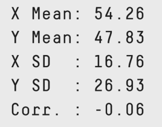

## There's something wrong with statistics?

Yes. These plots [all share the same stats](https://www.autodeskresearch.com/publications/samestats).

Stats | Plots
----- | -----
 | 

## Let's Try Different Techniques!

We saw the flaws in using the mean (average) and standard deviation in the plots in the last slide. Here are some alternatives that we can use instead:

- Median
- Histogram
- Range and Innerquartile Range (IQR)
- Percentile Rank

## Average Order Value (AOV)

Why do we like AOV?

- Easy to reason about
- Easy to calculate
- Useful for estimating expected revenue

What doesn't AOV tell us?

## Slide with Plot

```{r, echo=FALSE}
plot(cars)
```

## Addendum

This talk was inspired by this interesting article from Stijn Debrouwere,
http://debrouwere.org/2017/02/01/unlearning-descriptive-statistics/

The gif of plots of the same statistics creating a dinosaur came from AutoDesk,
https://www.autodeskresearch.com/publications/samestats

